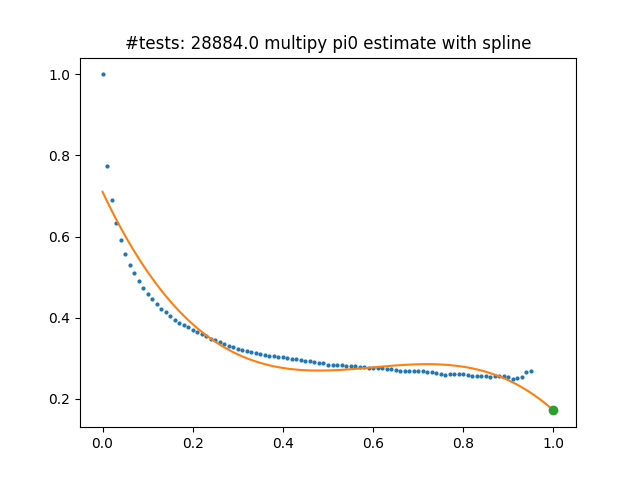
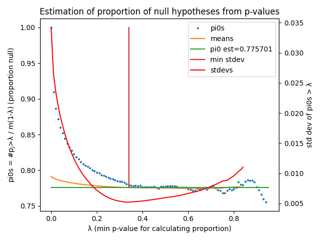

# qvalue
Storey[1] qvalue function that fixes the issue of misused splines in other versions.

Other python versions of this available on the web do not properly estimate pi0 because they use scipy.interpolate.splrep with s=0 (no smoothing). The pi0 estimate from these functions is simply the last pi0 value considered (which is usually a poor estimate) and the spline fitting does nothing. e.g.

https://pypi.org/project/qvalue/

https://github.com/nfusi/qvalue

https://gist.github.com/ryananeff/0232597b04ec1e5947de2ad8b9292d6e
  
Here, instead of splines, we are calculating the standard deviations of the pi0s > lambda. Since the pi0s tend to flatten out as lambda approaches 1 the standard deviation will tend to be at a minimum at the lambda where the pi0s converge to the null proportion. The pi0 is taken as the mean of the pi0s > lambda where the standard deviation is at a minimum. Below is a graphical illustration. The input data here are 28,884 t-test p-values from a differential rna-seq experiment. If the number of input p-values is less then 100 then pi0 is set to 1.0 which is too conservative. For such smaller datasets either determine a reasonable pi0 independently or use another method such as scipy.stats.false_discovery_control. The table below shows the estimates of pi0 (second column) when taking random subsamples from the 28,884 p-values in the plot below. Samples below ~2,000 can give more variable estimates. Visual inspection of plots for these subsets showed that the pi0 estimates were all positioned where one would intuitively expect the pi0s to converge.

<table>
  <caption><b>pi0 estimates as a function of number of tests.</b></caption>
  <tr><th># tests</th><th>p0 estimate</th><th>multipy</th></tr>
  <tr><td>128</td><td>0.0976501</td><td>0.0253196</td></tr>
  <tr><td>256</td><td>0.304663</td><td>0.290262</td></tr>
  <tr><td>512</td><td>0.292157</td><td>0.195398</td></tr>
  <tr><td>1024</td><td>0.203045</td><td>0.12255</td></tr>
  <tr><td>2048</td><td>0.191127</td><td>0.101718</td></tr>
  <tr><td>4096</td><td>0.239452</td><td>0.138288</td></tr>
  <tr><td>8192</td><td>0.254184</td><td>0.169034</td></tr>
  <tr><td>16384</td><td>0.269788</td><td>0.207793</td></tr>
  <tr><td>28884</td><td>0.255432</td><td>0.171282</td></tr>
</table>

After writing this function I noticed that the multipy package (https://github.com/puolival/multipy) includes a qvalue function that uses scipy.interpolate.UnivariateSpline to smooth the curve (As opposed to those above that attempt to use scipy.interpolate.splrep without smoothing, which accomplishes nothing). Using the identical subsamples as tested with our method, we calculated pi0 estimates with the multipy method and added them to the table above for comparison. It is clear that these UnivariateSpline estimates are much less stable and it's also clear, by comparing to the plot above, that the estimate for all 28,884 (0.171282) is much lower and may give overly optimistic qvalue estimates. The second plot below shows the spline used to estimate its pi0. The green dot at x=1 is the value of the spline curve used to estimate pi0.

We tested our method with samples generated with np.random.normal to test p-values with different underlying proportion of true null tests. For example, when both samples are generated with np.random.normal(0, 1, size=1000) then the pi0 estimate was always very close to 1.0. The plot below shows the pi0 estimate from 25,000 tests where, in 75% of them, both samples were generated with np.random.normal(0, 1, size=1000) and 25% where one had a mean of 0.1, np.random.normal(0.1, 1, size=1000). The pi0 estimate here is 0.776 compared to the underlying 0.75.

In looking at randomly generated normal distributions, both our standard deviation method and the UnivariateSpline method greatly overestimate pi0 when the magnitude of the differences in means is small relative to the standard deviation of the normal distribution and/or the number of samples drawn for each test is small. For tests where means differ sufficiently and enough samples are used, the standard deviation method tends to be a bit conservative (with respect to resulting q-values) and the spline method a bit optimistic.

[1] Storey JD, Tibshirani R (2003): Statistical significance for genomewide
    studies. The Proceedings of the National Academy of the United States of
    America 100(16):9440-9445. DOI: 10.1073/pnas.1530509100
